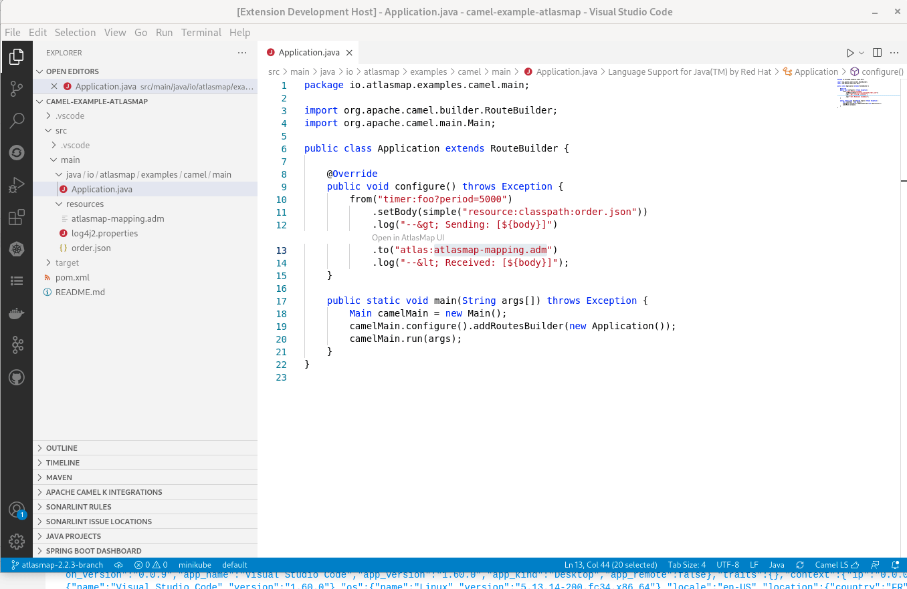
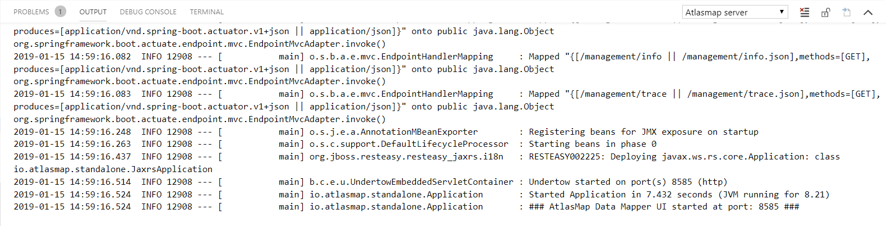

# AtlasMap in VS Code

## Prerequisites

-   Java 8+ must be installed on system path or configured through _JAVA_HOME_, _JDK_HOME_ or the VS Code setting _java.home_.

## Features

This extension is providing tooling for [AtlasMap](http://docs.atlasmap.io/) transformations:
* A command _Create AtlasMap file_ to create a new _*.adm_ and open it in the editor
* An editor to edit and save existing _*.adm_ files with AtlasMap UI.
* A codelens to open _*.adm_ file directly from textual editor with a Camel Route using a Camel AtlasMap endpoint.

### AtlasMap UI as an editor

When opening a _*.adm_ file, the AtlasMap UI is opening in an editor. It allows to use dirty/save lifecycle to update the AtlasMap Data transformation.

It remains possible to export your data transformation from the AtlasMap UI and save the artifact in another place.

### Load *.adm from Camel URI

When the *.adm file from a Camel URI can be resolved, a codelens is provided allowing to load it in AtlasMap UI.

Current conditions to have it resolved:
* First atlasmap declaration on the line
* Use `atlas:` (Camel 2) or `atlasmap:` (Camel 3+) scheme prefix
* Use default or classpath. E.g. `atlasmap:classpath:my.adm` or `atlasmap:my.adm`
* The pointed _*.adm_ file is either a sibling file to the Camel Route definition file or in `src/main/resources` at root of the workspace.

### AtlasMap Server output

To check if it has been started correctly, you can go to Output view and check for the "AtlasMap Server" output:

## Using AtlasMap

If you are not familiar with AtlasMap, then you'll first want to peruse the [AtlasMap documentation](http://docs.atlasmap.io/). As
noted there, AtlasMap currently provides integration capability between the following data types:

-   XML schema or instance files
-   JSON schema or instance files
-   Java class files

Bear in mind, however, the following caveats:

-   The AtlasMap documentation assumes it will be run in a standalone environment as opposed to being
    embedded within VS Code, so some of the information may not apply. In particular, you can ignore the first step, "1. Quickly get
    started using AtlasMap standalone".
-   This extension does not provide any type of runtime environment with which to execute mappings created by
    AtlasMap. Mappings will need to be exported once completed to an Apache Camel application, using the `camel-atlasmap` endpoint,
    as described in the [AtlasMap documentation](http://docs.atlasmap.io/#running-atlasmap-with-apache-camel).
-   Although the [documentation](https://docs.atlasmap.io/#exporting-mappings-to-an-atlasmap-catalog-file) states that
    exported mappings are always exported to the Downloads folder, within VS Code AtlasMap presents a file dialog allowing you to choose to which folder you wish to export mapping catalogs.
-   There is no relationship established between AtlasMap and your VS Code projects. File dialogs presented by
    AtlasMap allow for importing from or exporting to anywhere on your file system.
-   AtlasMap requires quite a bit of horizontal real-estate, so you may need to expand the width of your VS Code
    window.

## Relation between VS Code AtlasMap and AtlasMap runtime version

Each version of VS Code AtlasMap is embedding a specific AtlasMap UI version. The AtlasMap runtime is community supported with the exact same version of AtlasMap UI. When using a different version, this is not supported even if a lot of features are compatible between versions.

Corresponding versions between VS Code AtlasMap and AtlasMap runtime:

| VS Code AtlasMap version | AtlasMap version |
| ------------------------ | ---------------- |
| 0.1.3 | 2.4.0-M3 ? |
| 0.1.2 | 2.4.0-M3 |
| 0.1.1 | 2.4.0-M2 |
| 0.1.0 | 2.4.0-M1 |
| 0.0.9 | 2.3.2 |
| 0.0.8 | 2.2.3 |
| 0.0.7 | 2.1.6 |
| 0.0.6 | 2.0.5 |
| 0.0.5 | 1.43.4 |
| 0.0.4 | 1.42.10 |
| 0.0.3 | 1.41.1 |

For Red Hat Integration users, even if VS Code AtlasMap is not supported, here is a table with the closest version that you could try to use:

|Fuse version|AtlasMap upstream version|Closest VS Code AtlasMap|
|--------------|------------------|--------------------------------|
|7.11|2.4.x?|0.1.3 ? (using AtlasMap 2.4.0-M3?)|
|7.10|2.3.2|0.0.9 (using AtlasMap 2.3.2)|
|7.9|2.2.3|0.0.8 (using AtlasMap 2.2.3)|
|7.8|2.0.7|0.0.6 (using AtlasMap 2.0.5)|
|7.7|2.0.5|0.0.6 (using AtlasMap 2.0.5)|
|7.6|1.43.4|0.0.5 (using AtlasMap 1.43.4)|
|7.5|1.42.9|0.0.4 (using AtlasMap 1.42.10)|
|7.4|1.40.2|0.0.3 (using AtlasMap 1.41.1)|
|7.3|1.39.6|0.0.3 (using AtlasMap 1.41.1)|
|7.2|1.38.1|0.0.3 (using AtlasMap 1.41.1)|
|7.1|1.35.7|0.0.3 (using AtlasMap 1.41.1)|
|7.0|1.34.5|0.0.3 (using AtlasMap 1.41.1)|

By default, VS Code extensions are automatically updated. To use an older VS Code Extension version, you will need to deactivate auto-update by changing the setting: File -> Settings -> Extensions: Auto Update

Older VS Code AtlasMap versions are downloadable from [JBoss Tools repository](https://download.jboss.org/jbosstools/vscode/stable/vscode-atlasmap/).

## Data and telemetry

The AtlasMap by Red Hat for Visual Studio Code collects anonymous [usage data](USAGE_DATA.md) and sends it to Red Hat servers to help improve our products and services. Read our [privacy statement](https://developers.redhat.com/article/tool-data-collection) to learn more. This extension respects the `redhat.elemetry.enabled` setting which you can learn more about at https://github.com/redhat-developer/vscode-commons#how-to-disable-telemetry-reporting
