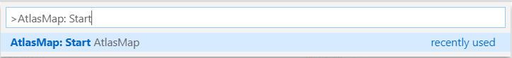

# AtlasMap in VS Code

## Features

This extension is providing 2 commands to help development of [AtlasMap](http://docs.atlasmap.io/) transformation.

### Start an AtlasMap instance

"AtlasMap: Start AtlasMap" command is starting an AtlasMap instance locally:

AtlasMap is started on port 8585.
To check that it has been started correctly, you can go to Output view and check for the "AtlasMap server" output:

### Open an AtlasMap instance

"AtlasMap: Open AtlasMap in default system browser" is opening the default system browser on 127.0.0.1:8585 address which is the URL used if you launched AtlasMap through the "Start AtlasMap" command.

It opens with some default Data types.

 It allows to create and edit Data transformation using AtlasMap. When the Data transformation is finished, you can export it from AtlasMap UI and copy the artifact in your project.

## Prerequisites

- java 8+ must be installed on system path
- port 8585 must be available
