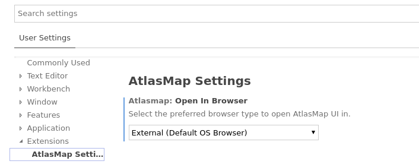
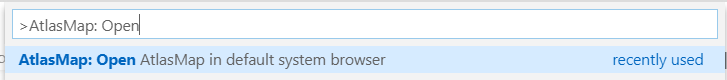
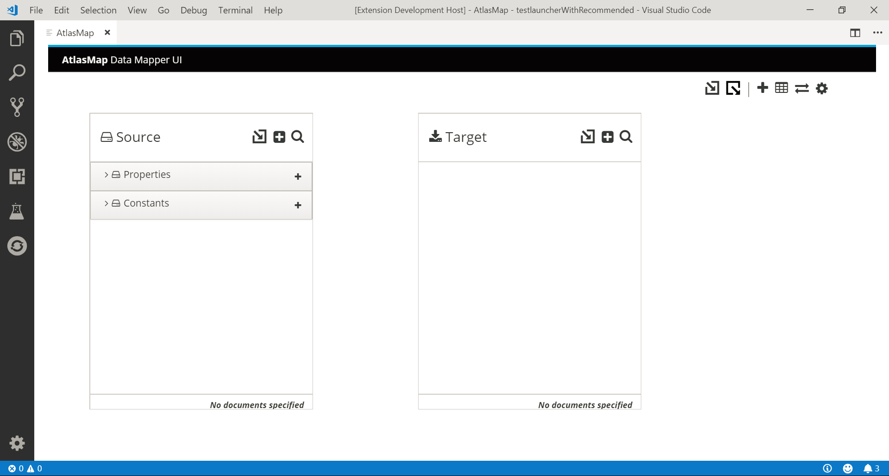

# AtlasMap in VS Code

## Prerequisites

-   Java 8+ must be installed on system path

## Features

This extension is providing a command to help development of [AtlasMap](http://docs.atlasmap.io/) transformations.

### Choose your preferred browser type (optional)

Inside the VS Code Preferences you can choose what browser type you want to open the AtlasMap UI with.

Possible choices:

-   Internal (This is the default and will open the AtlasMap UI inside VS Code in a dedicated view)
-   External (This will open the AtlasMap UI in the default OS browser externally)

    

### Start an AtlasMap instance

The "AtlasMap: Open AtlasMap" command starts a local AtlasMap instance and opens a Web View or an external browser pointing to its
web UI:

AtlasMap is started on port 8585 by default. If this port is occupied another free port will be chosen automatically.
To check if it has been started correctly, you can go to Output view and check for the "AtlasMap Server" output:

The AtlasMap web interface opens with the last edited Data transformation.

It allows you to create and modify data transformations using AtlasMap. You can export your data transformation from the AtlasMap UI
and save the artifact into your project.

## Using AtlasMap

If you are not familiar with AtlasMap, then you'll first want to peruse the [AtlasMap documentation](http://docs.atlasmap.io/). As
noted there, AtlasMap currently provides integration capability between the following data types:

-   XML schema or instance files
-   JSON schema or instance files
-   Java class files

Bear in mind, however, the following caveats:

-   The AtlasMap documentation assumes it will be run in a standalone environment as opposed to being
    embedded within VS Code, so some of the information may not apply. In particular, you can ignore the first step, "1. Quickly get
    started using AtlasMap standalone".
-   This extension does not provide any type of runtime environment with which to execute mappings created by
    AtlasMap. Mappings will need to be exported once completed to an Apache Camel application, using the `camel-atlasmap` endpoint,
    as described in the [AtlasMap documentation](http://docs.atlasmap.io/#running-atlasmap-with-apache-camel).
-   Although the [documentation](https://docs.atlasmap.io/#exporting-mappings-to-an-atlasmap-catalog-file) states that
    exported mappings are always exported to the Downloads folder, within VS Code AtlasMap presents a file dialog allowing you to choose to which folder you wish to export mapping catalogs.
-   There is no relationship established between AtlasMap and your VS Code projects. File dialogs presented by
    AtlasMap allow for importing from or exporting to anywhere on your file system.
-   AtlasMap requires quite a bit of horizontal real-estate, so you may need to expand the width of your VS Code
    window.
